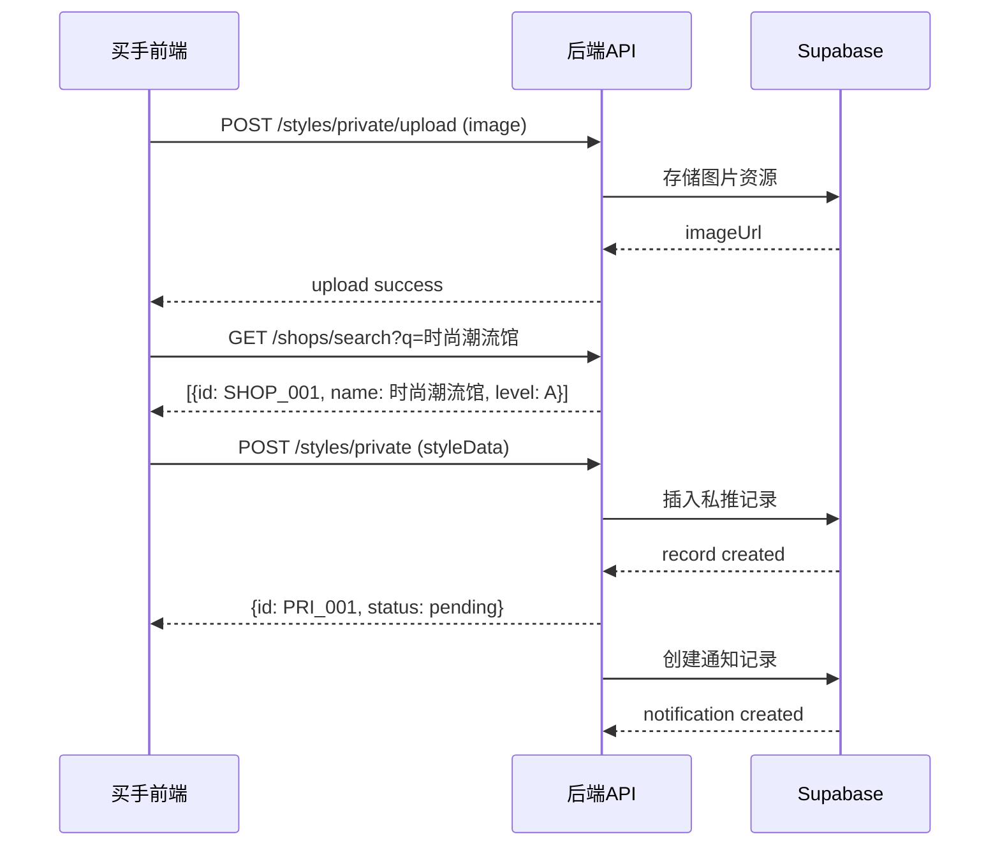
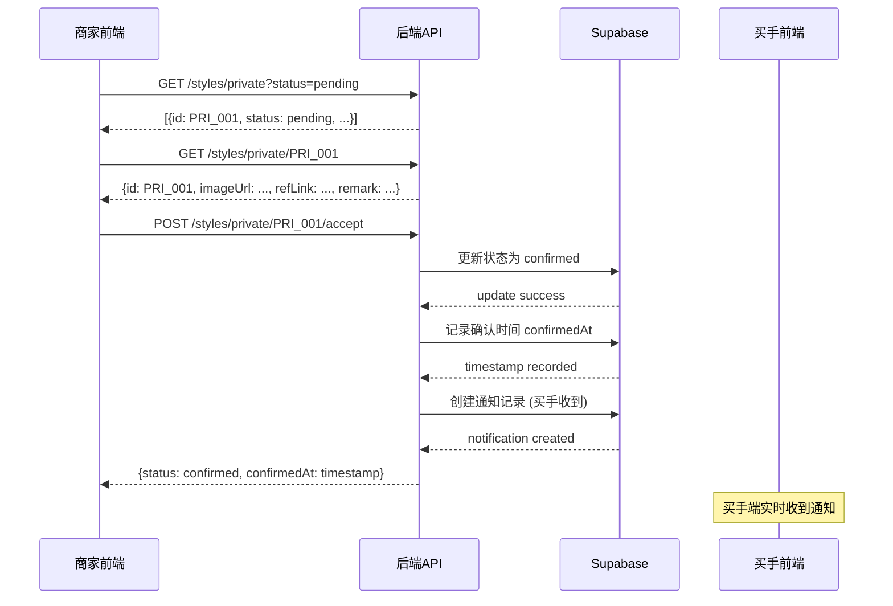
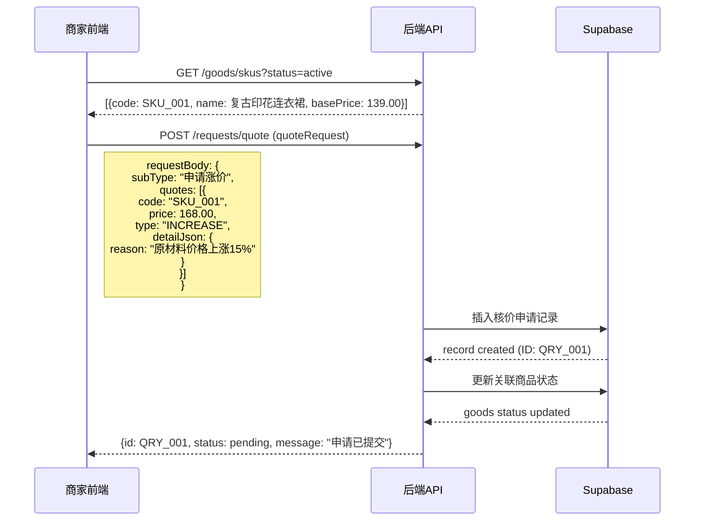
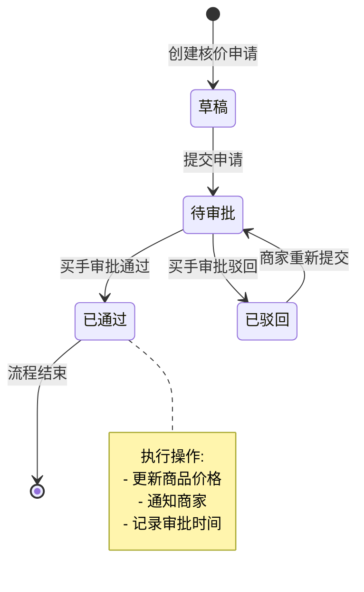
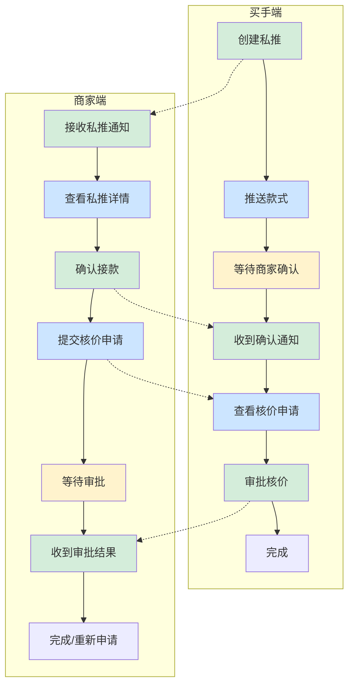
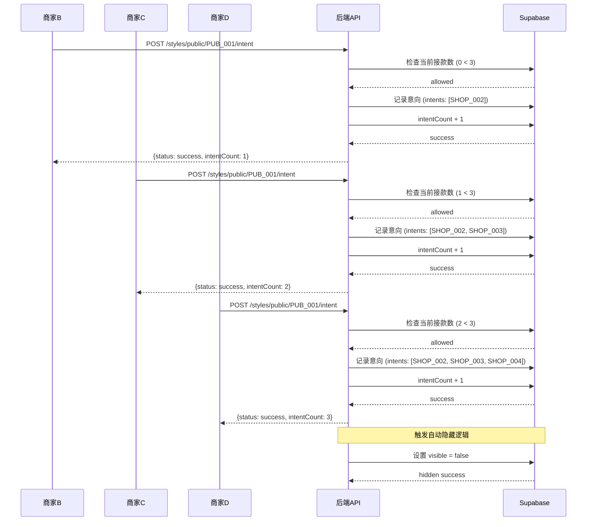
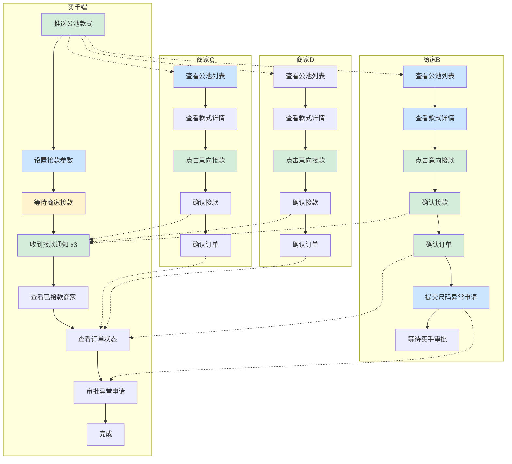
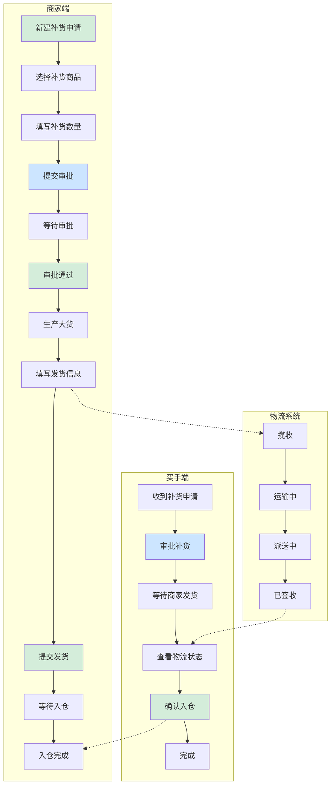
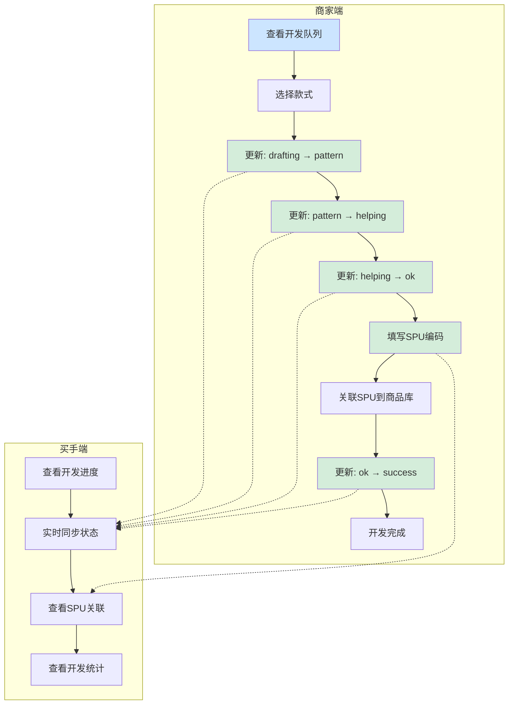
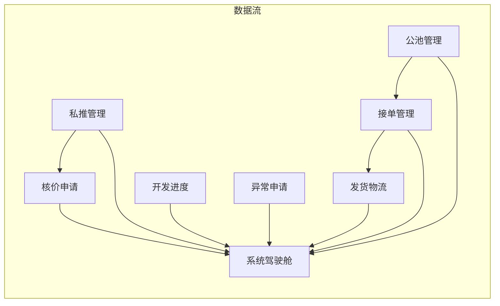

# SCM镜面场景测试

**文档版本**: v1.0  
**创建日期**: 2024年12月  
**测试范围**: SCM系统功能模块串联验证  
**文档状态**: 正式发布

---

## 目录

1. [文档概述](#1-文档概述)
2. [场景一：私推款式接款与核价完整流程](#2-场景一私推款式接款与核价完整流程)
3. [场景二：公池款式接款与异常处理完整流程](#3-场景二公池款式接款与异常处理完整流程)
4. [场景三：补货订单全流程协同](#4-场景三补货订单全流程协同)
5. [场景四：开发进度跟踪与SPU关联](#5-场景四开发进度跟踪与spu关联)
6. [测试验证标准](#6-测试验证标准)
7. [附录：功能模块清单](#7-附录功能模块清单)

---

## 1. 文档概述

### 1.1 测试目的

本文档旨在通过设计完整的业务场景，将SCM系统中各个独立的前端功能模块进行系统性串联，以验证其在实际业务场景中的协同工作能力。通过模拟真实的业务流程，确保：

- 功能模块间的数据流转正确性
- 前后端交互的完整性
- 状态变更的可追溯性
- 异常处理的健壮性

### 1.2 测试范围

本测试文档覆盖以下功能模块的串联验证：

| 序号 | 模块名称 | 模块编号 | 涉及功能 |
|:---:|---------|:-------:|---------|
| 1 | 私推管理 | M-01 | 款式推送、接款确认、放弃处理 |
| 2 | 公池管理 | M-02 | 款式推送、意向接款、配额控制 |
| 3 | 核价申请 | M-03 | 价格审核、审批流程、驳回重试 |
| 4 | 异常申请 | M-04 | 问题上报、审批处理、状态同步 |
| 5 | 接单管理 | M-05 | 订单确认、砍量流程、状态更新 |
| 6 | 发货物流 | M-06 | 物流填写、状态跟踪、入仓确认 |
| 7 | 开发进度 | M-07 | 阶段更新、SPU关联、进度同步 |
| 8 | 系统驾驶舱 | M-08 | 数据统计、实时监控、快捷操作 |

### 1.3 前置条件

在执行以下场景测试前，需确保以下环境准备就绪：

```
前置条件清单：
├─ Supabase数据库连接正常
├─ 后端API服务运行中 (http://localhost:3001/api)
├─ 测试账号权限配置完成
│   ├─ 买手账号: buyer_test_001 (role: buyer)
│   └─ 商家账号: merchant_test_001 (role: merchant)
├─ 初始测试数据准备
│   ├─ 店铺信息: 3家测试店铺
│   ├─ SKC商品: 10个测试商品
│   └─ 订单记录: 5条初始订单
└─ 测试环境清理完成
```

---

## 2. 场景一：私推款式接款与核价完整流程

### 2.1 场景概述

| 项目 | 内容 |
|------|------|
| **场景编号** | SCN-001 |
| **场景名称** | 私推款式接款与核价完整流程 |
| **涉及角色** | 买手、商家 |
| **涉及模块** | 私推管理(M-01)、核价申请(M-03)、系统驾驶舱(M-08) |
| **预估时长** | 约15-20分钟 |
| **复杂度** | ⭐⭐⭐⭐☆ (中等偏复杂) |

### 2.2 业务背景

买手小王在款式库中发现一款潜力款式，希望通过私推方式推给优质商家A进行合作。商家A收到推送后，需要完成接款确认、价格核验等流程，最终确认合作意向。整个过程涉及款式推送、接款确认、价格协商、审批通过等多个环节。

### 2.3 前置条件

```
环境准备状态：
├─ 买手账号 (buyer_test_001) 已登录系统
├─ 商家账号 (merchant_test_001) 已登录系统  
├─ 店铺"时尚潮流馆"(SHOP_001) 状态正常，等级A级
├─ 已有测试款式"复古印花连衣裙"(STYLE_001) 准备就绪
│   ├─ 图片: https://example.com/style_001.jpg
│   ├─ 参考链接: https://example.com/ref/001
│   ├─ 视觉风格: 人模
│   └─ 款式风格: 优雅风
└─ 系统驾驶舱数据初始化完成
```

### 2.4 详细操作流程

#### 阶段一：买手创建私推款式

**操作步骤：**

| 步骤 | 操作人 | 操作路径 | 操作内容 | 预期结果 |
|:---:|------|---------|---------|---------|
| 1 | 买手 | 买手端 > 私推管理 > 创建私推 | 点击"创建私推"按钮 | 打开私推创建表单 |
| 2 | 买手 | 私推创建表单 > 上传图片 | 上传款式图片 style_001.jpg | 图片上传成功，显示预览 |
| 3 | 买手 | 私推创建表单 > 填写参考链接 | 输入参考链接 https://example.com/ref/001 | 链接格式验证通过 |
| 4 | 买手 | 私推创建表单 > 选择视觉风格 | 视觉风格选择"人模" | 视觉风格已选 |
| 5 | 买手 | 私推创建表单 > 选择款式风格 | 款式风格选择"优雅风" | 款式风格已选 |
| 6 | 买手 | 私推创建表单 > 搜索目标店铺 | 搜索店铺"时尚潮流馆" | 店铺搜索结果返回 SHOP_001 |
| 7 | 买手 | 私推创建表单 > 关联店铺 | 勾选店铺 SHOP_001 | 店铺已关联 |
| 8 | 买手 | 私推创建表单 > 提交推送 | 点击"确认推送"按钮 | 私推创建成功，生成记录 ID: PRI_001 |

**API调用序列：**



#### 阶段二：商家接收并确认私推

**操作步骤：**

| 步骤 | 操作人 | 操作路径 | 操作内容 | 预期结果 |
|:---:|------|---------|---------|---------|
| 1 | 商家 | 商家端 > 私推管理 > 待确认 | 查看待确认私推列表 | 显示款式 PRI_001 |
| 2 | 商家 | 私推详情页 | 点击款式卡片查看详情 | 打开详情页面，展示完整信息 |
| 3 | 商家 | 私推详情页 | 浏览款式图片、参考链接 | 图片加载成功，链接可点击 |
| 4 | 商家 | 私推详情页 | 查看买手备注信息 | 备注信息显示完整 |
| 5 | 商家 | 私推详情页 > 点击"接受款式" | 点击接受按钮 | 弹出确认对话框 |
| 6 | 商家 | 确认对话框 | 点击"确认接受" | 款式状态变更为"已确认" |
| 7 | 商家 | 私推管理 > 已确认 | 查看已确认列表 | PRI_001 出现在列表中 |

**功能交互点：**

```
私推接收功能交互说明：
┌─────────────────────────────────────────────────────────────────┐
│  商家端私推管理模块 (M-01)                                        │
├─────────────────────────────────────────────────────────────────┤
│  数据来源: 买手端创建的私推记录                                    │
│  展示内容:                                                        │
│    ├─ 款式图片 (imageUrl)                                        │
│    ├─ 参考链接 (refLink) - 可直接跳转                             │
│    ├─ 买手备注 (remark)                                          │
│    ├─ 推送时间 (createdAt)                                       │
│    └─ 店铺关联信息 (shopIds)                                     │
│                                                                 │
│  用户操作:                                                        │
│    ├─ 接受款式 → 触发 accept 动作                               │
│    │   └─ 状态变更: pending → confirmed                         │
│    │   └─ 时间戳记录: confirmedAt = NOW()                       │
│    │   └─ 通知买手: 发送私推确认通知                             │
│    │                                                              │
│    └─ 放弃款式 → 触发 abandon 动作                              │
│        └─ 状态变更: pending → abandoned                         │
│        └─ 原因记录: reason = 用户选择                            │
│        └─ 统计更新: 更新放弃原因分析数据                          │
└─────────────────────────────────────────────────────────────────┘
```

**API调用序列：**



#### 阶段三：商家提交核价申请

**操作步骤：**

| 步骤 | 操作人 | 操作路径 | 操作内容 | 预期结果 |
|:---:|------|---------|---------|---------|
| 1 | 商家 | 商家端 > 核价管理 > 新建申请 | 点击"新建核价申请" | 打开核价申请表单 |
| 2 | 商家 | 核价申请表单 > 选择核价类型 | 选择"申请涨价" | 显示对应的表单字段 |
| 3 | 商家 | 核价申请表单 > 选择目标商品 | 关联 SKU: SKU_001 | SKU 关联成功 |
| 4 | 商家 | 核价申请表单 > 填写申请价格 | 输入期望售价: 168.00元 | 价格填写完成 |
| 5 | 商家 | 核价申请表单 > 选择调价类型 | 调价类型: 涨价 | 类型已选 |
| 6 | 商家 | 核价申请表单 > 填写详细原因 | 输入: "原材料价格上涨15%" | 原因填写完成 |
| 7 | 商家 | 核价申请表单 > 提交申请 | 点击"提交审批"按钮 | 申请提交成功，生成核价记录 |

**功能交互点：**

```
核价申请功能交互说明：
┌─────────────────────────────────────────────────────────────────┐
│  商家端核价申请模块 (M-03)                                       │
├─────────────────────────────────────────────────────────────────┤
│  核价类型选项:                                                    │
│    ├─ 同款同价 - 保持原价不变                                     │
│    ├─ 申请涨价 - 价格上调                                        │
│    ├─ 毛织类核价 - 特殊品类核价                                  │
│    └─ 非毛织类核价 - 常规品类核价                                │
│                                                                 │
│  申请数据校验:                                                    │
│    ├─ SKU编码: 必填项，需存在于商品库                            │
│    ├─ 申请价格: 必填项，需大于0                                 │
│    ├─ 调价类型: 申请涨价时必填                                  │
│    └─ 申请理由: 申请涨价时必填，需说明原因                       │
│                                                                 │
│  状态流转:                                                        │
│    pending → under_review → approved/rejected                    │
│                                                                 │
│  关联操作:                                                        │
│    ├─ 提交时: 创建核价申请记录                                    │
│    ├─ 通过时: 更新商品核价状态                                    │
│    └─ 驳回时: 通知商家可重新申请                                 │
└─────────────────────────────────────────────────────────────────┘
```

**API调用序列：**



#### 阶段四：买手审批核价申请

**操作步骤：**

| 步骤 | 操作人 | 操作路径 | 操作内容 | 预期结果 |
|:---:|------|---------|---------|---------|
| 1 | 买手 | 买手端 > 核价审批 > 待审批 | 查看待审批核价列表 | 显示 QRY_001 |
| 2 | 买手 | 核价详情页 | 点击申请查看详情 | 打开详情页面 |
| 3 | 买手 | 核价详情页 | 查看商家申请信息 | 显示: 原价139.00，申请168.00 |
| 4 | 买手 | 核价详情页 | 查看申请原因 | 显示: "原材料价格上涨15%" |
| 5 | 买手 | 核价详情页 > 价格核算 | 核算合理价格 | 系统计算建议价格 |
| 6 | 买手 | 核价详情页 > 填写买手价格 | 输入买手审核价格: 158.00元 | 价格填写完成 |
| 7 | 买手 | 核价详情页 > 审批操作 | 点击"审批通过"按钮 | 审批成功 |
| 8 | 买手 | 核价审批 > 已审批 | 查看已审批列表 | QRY_001 状态更新 |

**功能交互点：**

```
核价审批功能交互说明：
┌─────────────────────────────────────────────────────────────────┐
│  买手端核价审批模块 (M-03)                                       │
├─────────────────────────────────────────────────────────────────┤
│  待审批列表展示:                                                  │
│    ├─ 商家名称: 时尚潮流馆                                       │
│    ├─ 商品信息: SKU_001 - 复古印花连衣裙                         │
│    ├─ 申请类型: 申请涨价                                         │
│    ├─ 申请价格: 168.00元                                        │
│    ├─ 原价格: 139.00元                                          │
│    ├─ 涨幅比例: 20.86%                                          │
│    └─ 申请原因: 原材料上涨15%                                   │
│                                                                 │
│  买手操作选项:                                                    │
│    ├─ 审批通过                                                   │
│    │   ├─ 填写买手审核价格                                      │
│    │   └─ 可添加审批意见                                        │
│    │                                                            │
│    └─ 审批驳回                                                   │
│        ├─ 填写驳回原因                                          │
│        └─ 商家可重新提交申请                                     │
│                                                                 │
│  审批通过后:                                                      │
│    ├─ 更新核价记录状态: approved                                 │
│    ├─ 更新商品核价: newPrice = 买手价格                         │
│    ├─ 通知商家审批结果                                           │
│    └─ 更新驾驶舱统计数据                                         │
└─────────────────────────────────────────────────────────────────┘
```

**状态流转图：**



### 2.5 完整流程图



### 2.6 验证要点清单

| 序号 | 验证项 | 验证内容 | 验证方法 | 预期结果 |
|:---:|-------|---------|---------|---------|
| 1 | 私推创建 | 款式图片上传功能 | 检查图片URL返回 | 图片成功上传并可访问 |
| 2 | 私推创建 | 店铺搜索功能 | 验证搜索结果 | 返回正确的店铺信息 |
| 3 | 私推创建 | 推送通知发送 | 检查通知记录 | 商家收到推送通知 |
| 4 | 接款确认 | 状态变更 | 验证数据库状态 | pending → confirmed |
| 5 | 接款确认 | 确认时间记录 | 检查时间戳 | confirmedAt 正确记录 |
| 6 | 核价申请 | 数据校验 | 提交不合规数据 | 显示相应错误提示 |
| 7 | 核价申请 | 记录创建 | 检查数据库 | 生成正确的申请记录 |
| 8 | 审批功能 | 状态流转 | 验证审批后状态 | 状态正确更新 |
| 9 | 审批功能 | 通知发送 | 检查通知 | 商家收到审批结果 |
| 10 | 驾驶舱更新 | 统计数据 | 检查驾驶舱数据 | 统计数据实时更新 |

### 2.7 异常场景处理

| 异常情况 | 处理方式 | 预期结果 |
|---------|---------|---------|
| 商家放弃私推款式 | 系统记录放弃原因，通知买手 | 款式状态变更为 abandoned，通知发送成功 |
| 核价申请被驳回 | 商家可查看驳回原因，重新提交 | 商家收到通知，可编辑后重新提交 |
| 审批超时未处理 | 系统发送提醒通知 | 买手收到审批提醒 |
| 网络请求失败 | 自动重试机制 | 重试后仍失败显示错误提示 |

---

## 3. 场景二：公池款式接款与异常处理完整流程

### 3.1 场景概述

| 项目 | 内容 |
|------|------|
| **场景编号** | SCN-002 |
| **场景名称** | 公池款式接款与异常处理完整流程 |
| **涉及角色** | 买手、多家商家 |
| **涉及模块** | 公池管理(M-02)、接单管理(M-05)、异常申请(M-04)、发货物流(M-06) |
| **预估时长** | 约25-30分钟 |
| **复杂度** | ⭐⭐⭐⭐⭐ (复杂) |

### 3.2 业务背景

买手将一款新开发的春装款式推入公池，多家商家看到后进行意向接款。由于该款式非常热门，3个接款名额很快被抢完。接款成功的商家B在后续订单处理中发现商品存在尺码问题，需要提交异常申请。整个流程验证了公池竞争机制、订单确认、异常上报等多个功能模块的协同。

### 3.3 前置条件

```
环境准备状态：
├─ 买手账号 (buyer_test_001) 已登录
├─ 商家账号B (merchant_test_B) 已登录，店铺"精品女装馆"(SHOP_002)
├─ 商家账号C (merchant_test_C) 已登录，店铺"时尚韩风"(SHOP_003)
├─ 商家账号D (merchant_test_D) 已登录，店铺"甜美穿搭"(SHOP_004)
├─ 公池款式"春季碎花裙"(PUB_001) 准备就绪
│   ├─ 最大接款数: 3
│   ├─ 接款期限: 7天后
│   └─ 分类标签: 女装, 连衣裙, 碎花
└─ 系统运行正常
```

### 3.4 详细操作流程

#### 阶段一：买手推送公池款式

**操作步骤：**

| 步骤 | 操作人 | 操作路径 | 操作内容 | 预期结果 |
|:---:|------|---------|---------|---------|
| 1 | 买手 | 买手端 > 公池管理 > 推送新款 | 点击"推送公池"按钮 | 打开公池推送表单 |
| 2 | 买手 | 公池推送表单 > 上传图片 | 上传款式图片 spring_001.jpg | 图片上传成功 |
| 3 | 买手 | 公池推送表单 > 填写款式名称 | 输入"春季碎花裙" | 名称填写完成 |
| 4 | 买手 | 公池推送表单 > 设置最大接款数 | 输入"3" | 最大接款数设置为3 |
| 5 | 买手 | 公池推送表单 > 设置接款期限 | 选择7天后 | 截止日期设置完成 |
| 6 | 买手 | 公池推送表单 > 选择分类标签 | 选择: 女装, 连衣裙, 碎花 | 标签添加成功 |
| 7 | 买手 | 公池推送表单 > 提交推送 | 点击"确认推送"按钮 | 公池款式创建成功 |

**功能交互点：**

```
公池推送功能交互说明：
┌─────────────────────────────────────────────────────────────────┐
│  买手端公池推送模块 (M-02)                                       │
├─────────────────────────────────────────────────────────────────┤
│  推送参数配置:                                                    │
│    ├─ 最大接款数 (maxIntents): 限制可接款商家数量               │
│    │   └─ 达到上限后款式自动从公池隐藏                          │
│    │                                                            │
│    ├─ 接款期限 (deadline): 设置接款截止时间                     │
│    │   └─ 过期后款式自动下架                                    │
│    │                                                            │
│    └─ 分类标签 (tags): 用于商家筛选                             │
│        └─ 支持多级分类: 女装 > 连衣裙 > 碎花                     │
│                                                                 │
│  数据初始化:                                                      │
│    ├─ intentCount: 0 (意向计数初始化)                          │
│    ├─ status: pending (初始状态)                                │
│    ├─ visible: true (公开展示)                                 │
│    └─ intents: [] (意向商家列表)                               │
│                                                                 │
│  发布后通知:                                                      │
│    └─ 所有商家收到新款式上架通知                                 │
└─────────────────────────────────────────────────────────────────┘
```

#### 阶段二：多家商家竞争接款

**操作步骤：**

| 步骤 | 操作人 | 操作路径 | 操作内容 | 预期结果 |
|:---:|------|---------|---------|---------|
| 1 | 商家B | 商家端 > 公池管理 > 公池列表 | 查看公池款式列表 | 显示 PUB_001 |
| 2 | 商家B | 公池详情页 | 点击查看款式详情 | 展示完整信息 |
| 3 | 商家B | 公池详情页 > 点击"意向接款" | 点击接款按钮 | 弹出确认对话框 |
| 4 | 商家B | 确认对话框 | 点击"确认接款" | 接款成功，计数+1 |
| 5 | 商家C | 商家端 > 公池管理 > 公池列表 | 查看公池列表 | PUB_001 仍显示 |
| 6 | 商家C | 公池详情页 | 点击"意向接款" | 接款成功，计数+1 |
| 7 | 商家D | 商家端 > 公池管理 > 公池列表 | 查看公池列表 | PUB_001 仍显示 |
| 8 | 商家D | 公池详情页 > 点击"意向接款" | 点击接款按钮 | 接款成功，计数满 |

**接款竞争流程图：**



**配额验证逻辑：**

```
商家接款配额检查流程：
┌─────────────────────────────────────────┐
│  商家请求接款 (SHOP_002)                 │
└─────────────────────────────────────────┘
                    │
                    ▼
┌─────────────────────────────────────────┐
│  Step 1: 检查店铺配额限制                │
│  ├─ 检查店铺总接款数上限                 │
│  ├─ 检查当前周期内接款数                 │
│  └─ 检查是否有未完成订单                 │
└─────────────────────────────────────────┘
                    │
                    ▼
        ┌───────────┴───────────┐
        │                       │
      通过 ✓                   拒绝 ✗
        │                       │
        ▼                       ▼
┌───────────────┐    ┌─────────────────────────┐
│ Step 2: 检查   │    │ 返回错误:               │
│ 公池接款上限   │    │ - 超过店铺配额限制      │
│ (intentCount)  │    │ - 超过公池接款上限     │
└───────────────┘    └─────────────────────────┘
        │
        ▼
┌─────────────────────────────────────────┐
│  Step 3: 记录接款信息                    │
│  ├─ 添加到 intents 列表                 │
│  ├─ intentCount + 1                     │
│  ├─ 发送接款通知给买手                   │
│  └─ 检查是否达到上限触发隐藏             │
└─────────────────────────────────────────┘
```

#### 阶段三：商家确认订单

**操作步骤：**

| 步骤 | 操作人 | 操作路径 | 操作内容 | 预期结果 |
|:---:|------|---------|---------|---------|
| 1 | 商家B | 商家端 > 订单管理 > 待确认 | 查看待确认订单列表 | 显示 PUB_001 对应订单 |
| 2 | 商家B | 订单详情页 | 查看订单详细信息 | 显示：商品、数量、价格 |
| 3 | 商家B | 订单详情页 > 填写接单数量 | 输入实际可接数量: 80件 | 数量填写完成 |
| 4 | 商家B | 订单详情页 > 提交确认 | 点击"确认接单" | 订单状态更新为已确认 |
| 5 | 买手 | 买手端 > 订单管理 > 已确认 | 收到商家确认通知 | 订单显示已确认 |

**功能交互点：**

```
订单确认功能交互说明：
┌─────────────────────────────────────────────────────────────────┐
│  商家端订单确认模块 (M-05)                                       │
├─────────────────────────────────────────────────────────────────┤
│  订单确认流程:                                                   │
│    ├─ 步骤1: 查看待确认订单列表                                 │
│    │   └─ 来源: 公池接款成功后自动生成                          │
│    │                                                            │
│    ├─ 步骤2: 查看订单详情                                       │
│    │   ├─ 商品信息: SKU、名称、图片                             │
│    │   ├─ 订单数量: 原订单数量                                 │
│    │   └─ 价格信息: 核定的商品单价                             │
│    │                                                            │
│    ├─ 步骤3: 填写实际可接数量                                   │
│    │   ├─ 可接数量 ≤ 原订单数量                               │
│    │   ├─ 填写砍量原因 (如需砍量)                              │
│    │   └─ 提交买手审核 (如砍量)                                │
│    │                                                            │
│    └─ 步骤4: 确认/取消订单                                     │
│        ├─ 确认: 订单状态 → confirmed                           │
│        └─ 取消: 订单状态 → cancelled + 原因记录                │
│                                                                 │
│  砍量处理流程 (数量减少时触发):                                  │
│    ├─ 商家填写砍量数量和原因                                    │
│    ├─ 买手收到砍量申请通知                                      │
│    ├─ 买手审核 (通过/驳回)                                      │
│    ├─ 通过: 订单数量更新                                        │
│    └─ 驳回: 商家需重新确认或取消                               │
└─────────────────────────────────────────────────────────────────┘
```

#### 阶段四：异常申请处理

**操作步骤：**

| 步骤 | 操作人 | 操作路径 | 操作内容 | 预期结果 |
|:---:|------|---------|---------|---------|
| 1 | 商家B | 商家端 > 异常申请 > 新建申请 | 点击"新建异常申请" | 打开异常申请表单 |
| 2 | 商家B | 异常申请表单 > 选择异常类型 | 选择"尺码问题" | 显示子类型选择 |
| 3 | 商家B | 异常申请表单 > 选择子类型 | 选择"新增尺码" | 子类型已选 |
| 4 | 商家B | 异常申请表单 > 关联商品 | 关联 SKU: SKU_002 | 商品关联成功 |
| 5 | 商家B | 异常申请表单 > 填写问题描述 | 输入"需要增加XL尺码" | 描述填写完成 |
| 6 | 商家B | 异常申请表单 > 提交申请 | 点击"提交审批"按钮 | 异常申请提交成功 |
| 7 | 买手 | 买手端 > 异常审批 > 待审批 | 查看待审批异常列表 | 显示该申请 |
| 8 | 买手 | 异常详情页 | 查看异常详情 | 显示完整信息 |
| 9 | 买手 | 异常详情页 > 审批操作 | 点击"审批通过" | 审批成功 |

**功能交互点：**

```
异常申请功能交互说明：
┌─────────────────────────────────────────────────────────────────┐
│  商家端异常申请模块 (M-04)                                       │
├─────────────────────────────────────────────────────────────────┤
│  异常类型分类:                                                   │
│    ├─ 尺码问题                                                   │
│    │   ├─ 新增尺码                                              │
│    │   └─ 修改尺码                                              │
│    │                                                            │
│    ├─ 图片异常                                                   │
│    │   ├─ 人台误判                                              │
│    │   └─ 换图误判                                              │
│    │                                                            │
│    ├─ 申请下架                                                   │
│    │   └─ 质量问题/滞销等原因                                   │
│    │                                                            │
│    └─ 大货异常                                                   │
│        ├─ 色差超标                                              │
│        ├─ 材质问题                                              │
│        └─ 工艺问题                                              │
│                                                                 │
│  数据校验规则:                                                   │
│    ├─ 关联商品: 必填，需选择有效SKU                             │
│    ├─ 问题描述: 必填，50-500字                                 │
│    └─ 凭证上传: 可选，支持图片格式                             │
│                                                                 │
│  状态流转:                                                       │
│    pending → under_review → approved/rejected                   │
└─────────────────────────────────────────────────────────────────┘
```

### 3.5 完整流程图



### 3.6 验证要点清单

| 序号 | 验证项 | 验证内容 | 验证方法 | 预期结果 |
|:---:|-------|---------|---------|---------|
| 1 | 公池推送 | 参数配置 | 检查数据库记录 | maxIntents=3, deadline正确 |
| 2 | 公池展示 | 商家端可见性 | 商家查看公池列表 | 新款式显示 |
| 3 | 接款竞争 | 并发处理 | 3个商家同时接款 | 全部成功，计数正确 |
| 4 | 自动隐藏 | 满额隐藏 | 商家D接款后检查 | 款式从列表隐藏 |
| 5 | 通知发送 | 买手通知 | 检查通知记录 | 3条接款通知 |
| 6 | 订单生成 | 订单创建 | 检查订单记录 | 3个关联订单生成 |
| 7 | 订单确认 | 状态更新 | 商家B确认后检查 | 状态变为 confirmed |
| 8 | 异常申请 | 类型选择 | 提交各类异常 | 各类型均可提交 |
| 9 | 异常审批 | 状态流转 | 买手审批后检查 | approved |
| 10 | 统计更新 | 驾驶舱数据 | 检查统计数据 | 实时更新 |

---

## 4. 场景三：补货订单全流程协同

### 4.1 场景概述

| 项目 | 内容 |
|------|------|
| **场景编号** | SCN-003 |
| **场景名称** | 补货订单全流程协同 |
| **涉及角色** | 商家、买手、物流系统 |
| **涉及模块** | 补货管理(M-06)、发货物流(M-06)、系统驾驶舱(M-08) |
| **预估时长** | 约20-25分钟 |
| **复杂度** | ⭐⭐⭐⭐☆ (中等偏复杂) |

### 4.2 业务背景

商家A的热销款式"韩版针织开衫"库存告急，需要向买手申请补货。买手审批通过后，商家进行大货生产。生产完成后，商家发货并填写物流信息。物流运输过程中，系统实时跟踪物流状态。到达入仓后，买手确认入仓，完成整个补货流程。

### 4.3 详细操作流程

#### 阶段一：商家提交补货申请

**操作步骤：**

| 步骤 | 操作人 | 操作路径 | 操作内容 | 预期结果 |
|:---:|------|---------|---------|---------|
| 1 | 商家 | 商家端 > 补货管理 > 新建申请 | 点击"新建补货申请" | 打开补货申请表单 |
| 2 | 商家 | 补货表单 > 选择补货商品 | 选择 SKU: SKU_003 | SKU 关联成功 |
| 3 | 商家 | 补货表单 > 填写计划数量 | 输入: 200件 | 计划数量填写完成 |
| 4 | 商家 | 补货表单 > 填写备注 | 输入: 热销款补货 | 备注填写完成 |
| 5 | 商家 | 补货表单 > 提交申请 | 点击"提交审批"按钮 | 申请提交成功 |
| 6 | 买手 | 买手端 > 补货审批 > 待审批 | 查看待审批列表 | 显示该申请 |
| 7 | 买手 | 买手详情页 | 审核补货申请 | 审批通过 |

**功能交互点：**

```
补货申请功能交互说明：
┌─────────────────────────────────────────────────────────────────┐
│  商家端补货申请模块                                               │
├─────────────────────────────────────────────────────────────────┤
│  申请流程:                                                       │
│    步骤1: 选择补货商品                                           │
│    ├─ 支持按SKU搜索                                             │
│    ├─ 显示商品图片、名称、当前库存                              │
│    └─ 显示历史补货记录                                          │
│                                                                 │
│    步骤2: 填写补货信息                                          │
│    ├─ 计划数量: 必填                                            │
│    ├─ 期望交期: 可选                                            │
│    ├─ 补货原因: 热销/断码/促销等                                │
│    └─ 备注说明: 可选                                            │
│                                                                 │
│    步骤3: 提交审批                                              │
│    └─ 生成补货申请记录                                          │
│                                                                 │
│  状态流转:                                                       │
│    draft → pending → approved → producing → shipped → arrived → completed │
└─────────────────────────────────────────────────────────────────┘
```

#### 阶段二：商家发货与物流跟踪

**操作步骤：**

| 步骤 | 操作人 | 操作路径 | 操作内容 | 预期结果 |
|:---:|------|---------|---------|---------|
| 1 | 商家 | 商家端 > 发货管理 > 待发货 | 查看待发货订单 | 显示补货订单 |
| 2 | 商家 | 发货详情页 | 查看发货信息 | 显示待发数量 |
| 3 | 商家 | 发货表单 > 填写物流公司 | 选择"顺丰速运" | 物流公司已选 |
| 4 | 商家 | 发货表单 > 填写物流单号 | 输入: SF1234567890 | 单号填写完成 |
| 5 | 商家 | 发货表单 > 填写发货数量 | 输入: 180件 | 发货数量填写完成 |
| 6 | 商家 | 发货表单 > 提交发货 | 点击"确认发货"按钮 | 发货成功 |
| 7 | 系统 | 后台任务 | 自动创建物流跟踪 | 跟踪记录创建成功 |
| 8 | 买手 | 买手端 > 物流跟踪 | 查看物流状态 | 显示运输中 |

**功能交互点：**

```
发货物流功能交互说明：
┌─────────────────────────────────────────────────────────────────┐
│  发货与物流跟踪模块 (M-06)                                       │
├─────────────────────────────────────────────────────────────────┤
│  发货流程:                                                       │
│    ├─ 填写物流信息                                              │
│    │   ├─ 物流公司: 必填 (支持下拉选择)                        │
│    │   ├─ 物流单号: 必填 (格式验证)                            │
│    │   └─ 发货数量: 必填 (≤计划数量)                          │
│    │                                                            │
│    └─ 发货确认                                                  │
│        ├─ 订单状态 → shipped                                   │
│        ├─ 生成物流跟踪记录                                      │
│        └─ 发送发货通知                                          │
│                                                                 │
│  物流跟踪流程:                                                    │
│    ├─ 初始化跟踪记录 (trackingId)                              │
│    ├─ 定时轮询物流API (每小时)                                  │
│    ├─ 更新物流状态                                              │
│    └─ 状态变更通知                                              │
│                                                                 │
│  物流状态:                                                       │
│    pending → shipped → in_transit → out_for_delivery → delivered → confirmed │
└─────────────────────────────────────────────────────────────────┘
```

#### 阶段三：入仓确认

**操作步骤：**

| 步骤 | 操作人 | 操作路径 | 操作内容 | 预期结果 |
|:---:|------|---------|---------|---------|
| 1 | 买手 | 买手端 > 入仓管理 > 待确认 | 查看待入仓列表 | 显示待确认记录 |
| 2 | 买手 | 入仓详情页 | 查看物流信息 | 显示物流公司和单号 |
| 3 | 买手 | 入仓详情页 > 核对数量 | 核对实收数量 | 数量核对完成 |
| 4 | 买手 | 入仓详情页 > 点击"确认入仓" | 点击确认按钮 | 入仓确认成功 |
| 5 | 系统 | 后台处理 | 更新补货单状态 | 状态变为 completed |
| 6 | 系统 | 后台处理 | 更新库存数据 | 库存增加 |
| 7 | 商家 | 商家端 > 补货记录 | 查看补货完成状态 | 显示已完成 |

### 4.4 完整流程图



---

## 5. 场景四：开发进度跟踪与SPU关联

### 5.1 场景概述

| 项目 | 内容 |
|------|------|
| **场景编号** | SCN-004 |
| **场景名称** | 开发进度跟踪与SPU关联 |
| **涉及角色** | 商家、买手 |
| **涉及模块** | 开发进度(M-07)、SPU库(M-08)、系统驾驶舱(M-08) |
| **预估时长** | 约15-20分钟 |
| **复杂度** | ⭐⭐⭐☆☆ (中等) |

### 5.2 业务背景

买手在款式开发过程中，需要跟踪商家的打版进度。商家按阶段更新开发状态（起草→打版→辅料→确认→大货完成），并在确认后填写SPU编码关联正式商品档案。买手可以实时查看各阶段进度，确保开发周期可控。

### 5.3 详细操作流程

#### 阶段一：开发进度更新

**操作步骤：**

| 步骤 | 操作人 | 操作路径 | 操作内容 | 预期结果 |
|:---:|------|---------|---------|---------|
| 1 | 商家 | 商家端 > 开发进度 > 开发中 | 查看开发队列 | 显示待开发款式 |
| 2 | 商家 | 进度详情页 | 选择款式 DEV_001 | 打开详情页 |
| 3 | 商家 | 进度详情页 > 更新为"打版中" | 选择状态: pattern | 状态更新成功 |
| 4 | 商家 | 进度详情页 > 更新为"辅料中" | 选择状态: helping | 状态更新成功 |
| 5 | 商家 | 进度详情页 > 更新为"确认完成" | 选择状态: ok | 状态更新成功 |
| 6 | 买手 | 买手端 > 开发进度 | 查看进度更新 | 实时同步状态 |

**功能交互点：**

```
开发进度跟踪功能交互说明：
┌─────────────────────────────────────────────────────────────────┐
│  开发进度跟踪模块 (M-07)                                         │
├─────────────────────────────────────────────────────────────────┤
│  状态流转阶段:                                                    │
│    drafting → pattern → helping → ok → success                 │
│                                                                 │
│  各阶段说明:                                                      │
│    ├─ drafting (起草中): 初始状态，款式设计阶段                 │
│    ├─ pattern (打版中): 打版制作阶段                            │
│    ├─ helping (辅料/协助中): 辅料准备阶段                       │
│    ├─ ok (确认完成): 大货准备就绪                               │
│    └─ success (大货完成): 生产完成                              │
│                                                                 │
│  状态更新规则:                                                    │
│    ├─ 只能按顺序更新 (不可跳级)                                 │
│    ├─ 每次更新记录时间戳                                        │
│    ├─ 同步通知买手端                                            │
│    └─ 更新驾驶舱进度统计                                        │
│                                                                 │
│  SPU关联 (ok阶段后可用):                                          │
│    ├─ 填写SPU编码                                               │
│    ├─ 关联正式商品档案                                          │
│    └─ 生成商品链接                                               │
└─────────────────────────────────────────────────────────────────┘
```

#### 阶段二：SPU编码关联

**操作步骤：**

| 步骤 | 操作人 | 操作路径 | 操作内容 | 预期结果 |
|:---:|------|---------|---------|---------|
| 1 | 商家 | 开发进度详情页 | 状态已更新为"ok" | SPU编码字段可编辑 |
| 2 | 商家 | SPU编码字段 | 输入: SPU20241218001 | SPU编码填写完成 |
| 3 | 商家 | SPU关联操作 | 点击"关联SPU" | 关联成功 |
| 4 | 系统 | 后台处理 | 同步到SPU库 | SPU库更新记录 |
| 5 | 买手 | 买手端 > SPU库 | 查看已关联SPU | 新记录显示 |
| 6 | 商家 | 进度详情页 | 更新为"success" | 状态更新成功 |

### 5.4 完整流程图



---

## 6. 测试验证标准

### 6.1 通用验证标准

| 验证类别 | 验证项目 | 验证标准 |
|---------|---------|---------|
| **数据正确性** | API响应 | 状态码 200，数据格式正确 |
| | 数据库写入 | 数据持久化成功，字段值正确 |
| | 状态流转 | 状态按预期变更 |
| **功能完整性** | 操作响应 | 用户操作后有明确反馈 |
| | 异常处理 | 错误情况有友好提示 |
| | 边界校验 | 边界值情况处理正确 |
| **性能要求** | 响应时间 | API响应 < 2秒 |
| | 并发处理 | 10并发请求正常处理 |
| **安全要求** | 权限控制 | 无权限访问被拒绝 |
| | 数据隔离 | 只能访问授权数据 |

### 6.2 场景专项验证表

| 场景 | 专项验证项 | 验证方法 |
|------|-----------|---------|
| SCN-001 | 私推通知实时性 | 商家接款后检查买手端通知时间差 < 3秒 |
| SCN-001 | 核价状态同步 | 审批后检查商家端状态更新时间 < 5秒 |
| SCN-002 | 公池竞争原子性 | 3个商家同时接款，计数准确无重复 |
| SCN-002 | 自动隐藏触发 | 第3个商家接款后立即检查可见性 |
| SCN-003 | 物流跟踪轮询 | 检查定时任务是否正确执行 |
| SCN-004 | 进度状态顺序 | 验证不能跳过状态直接更新 |

### 6.3 测试数据清理标准

测试完成后需清理的数据：

```
清理清单：
├─ 测试创建的私推记录 (styles_private)
├─ 测试创建的公池记录 (styles_public)
├─ 测试创建的核价申请 (requests_quote)
├─ 测试创建的异常申请 (requests_anomaly)
├─ 测试创建的订单记录 (orders)
├─ 测试创建的补货记录 (b_restock_order)
├─ 测试创建的物流记录 (b_restock_logistics)
├─ 测试创建的开发进度记录 (development_progress)
├─ 测试创建的通知记录 (notifications)
└─ 测试创建的SPU记录 (spu_library)
```

---

## 7. 附录：功能模块清单

### 7.1 模块详细说明

| 模块编号 | 模块名称 | 核心功能 | 关联模块 |
|:-------:|---------|---------|---------|
| M-01 | 私推管理 | 款式推送、接款确认、放弃处理 | M-03, M-08 |
| M-02 | 公池管理 | 款式推送、意向接款、配额控制 | M-05, M-08 |
| M-03 | 核价申请 | 价格审核、审批流程、驳回重试 | M-01, M-02 |
| M-04 | 异常申请 | 问题上报、审批处理、状态同步 | M-05, M-08 |
| M-05 | 接单管理 | 订单确认、砍量流程、状态更新 | M-02, M-06 |
| M-06 | 发货物流 | 物流填写、状态跟踪、入仓确认 | M-05, M-08 |
| M-07 | 开发进度 | 阶段更新、SPU关联、进度同步 | M-08 |
| M-08 | 系统驾驶舱 | 数据统计、实时监控、快捷操作 | 全模块 |

### 7.2 模块间数据流转



### 7.3 文档修订历史

| 版本 | 日期 | 修订内容 | 修订人 |
|:---:|------|---------|-------|
| v1.0 | 2024-12 | 初始版本发布 | 测试团队 |

---

**文档结束**

如需执行测试，请参考各场景的操作步骤，使用可视化测试运行器或命令行工具执行对应的测试用例。
